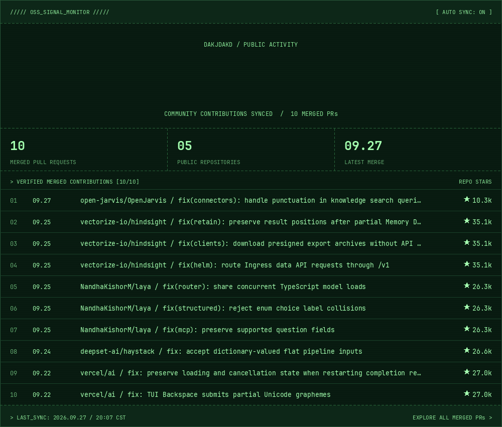

<h1>👋😊 I'm Lucien </h1>

<strong>AI Builder</strong> · LLM Applications · Agent Workflow · RAG

Turning AI capabilities into useful, demonstrable products.

  <a href="https://github.com/dakjdakd">🐙 GitHub</a>
  &nbsp;·&nbsp;
  <a href="https://llq-ai-builder-portfolio.netlify.app/">🌐 Portfolio</a>
  &nbsp;·&nbsp;
  <a href="mailto:1428823446@qq.com">✉️ Email</a>
  &nbsp;·&nbsp;
  <a href="docs/contact.md">💬 WeChat</a>

<a href="docs/README.zh-CN.md">中文</a> &nbsp;·&nbsp; <a href="docs/README.en.md">English</a>

---

<h2 align="center">🧭 About Me</h2>

  I am an Artificial Intelligence undergraduate and AI Builder focused on turning 
  LLM capabilities into useful, demonstrable products.

  I connect AI engineering, product thinking, visual expression, and content creation 
  into a complete build-and-share loop.

  LLM applications &nbsp;·&nbsp; Agent workflow &nbsp;·&nbsp; RAG &nbsp;·&nbsp; Context engineering &nbsp;·&nbsp; AI-native products

<h2 align="center">⌁ Open Source Contributions</h2>

  

